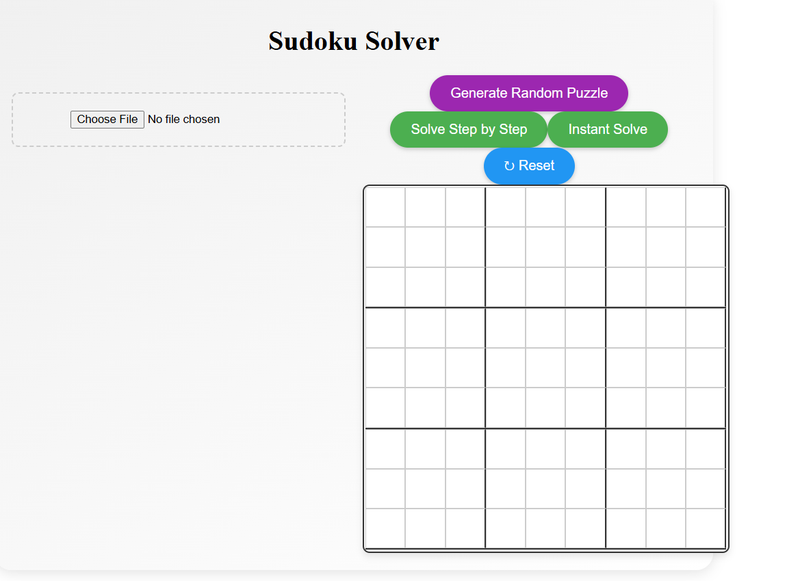
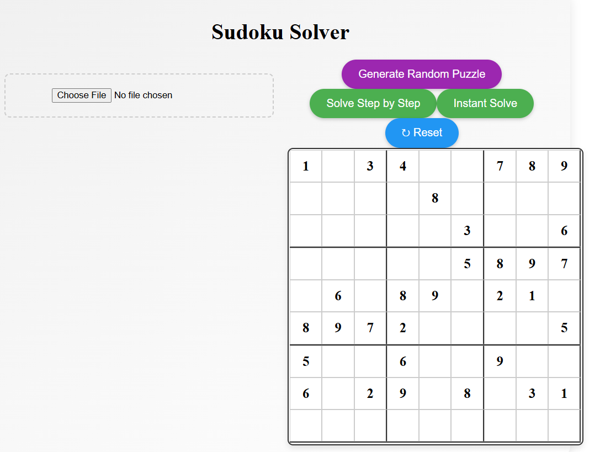

# 🧩 Sudoku Solver

A modern web application for solving Sudoku puzzles with OCR capabilities.


## 📚 Documentation

- [User Guide](./docs/user-guide.md)
- [Developer Guide](./docs/developer-guide.md)
- [API Documentation](./docs/api.md)
- [Contributing Guidelines](./docs/contributing.md)

## ✨ Features

- 📸 OCR-powered puzzle import
- 🎲 Random puzzle generation
- ⌨️ Interactive manual input
- 🎯 Step-by-step solution visualization
- ⚡ Instant solve mode
- 📱 Responsive design

[View full feature list](./docs/features.md)

## 🚀 Quick Start

```bash
# Clone repository
git clone https://github.com/yourusername/sudoku-solver.git

# Install dependencies
cd sudoku-solver
npm install

# Start development server
npm run dev
```

Visit `http://localhost:5173` in your browser.

## 🛠️ Tech Stack

- React 18 + Vite
- Tesseract.js for OCR
- Modern CSS3

[View complete tech details](./docs/tech-stack.md)

## 📖 Usage

1. **Upload a Puzzle**
   - Click "Upload Image" or drag & drop
   - Supports PNG, JPG formats
   
2. **Manual Input**
   - Click cells to select
   - Type numbers 1-9
   - Backspace to clear

3. **Solve**
   - "Step by Step" for visualization
   - "Instant Solve" for quick results

[View full user guide](./docs/user-guide.md)


## 🤝 Contributing

We welcome contributions! Please see our [Contributing Guide](./docs/contributing.md).

## 📄 License

MIT © [Your Name]

## 🔗 Links

- [Live Demo](https://your-demo-url.netlify.app)
- [Documentation](https://your-docs-url.netlify.app)
- [Issue Tracker](https://github.com/yourusername/sudoku-solver/issues)
